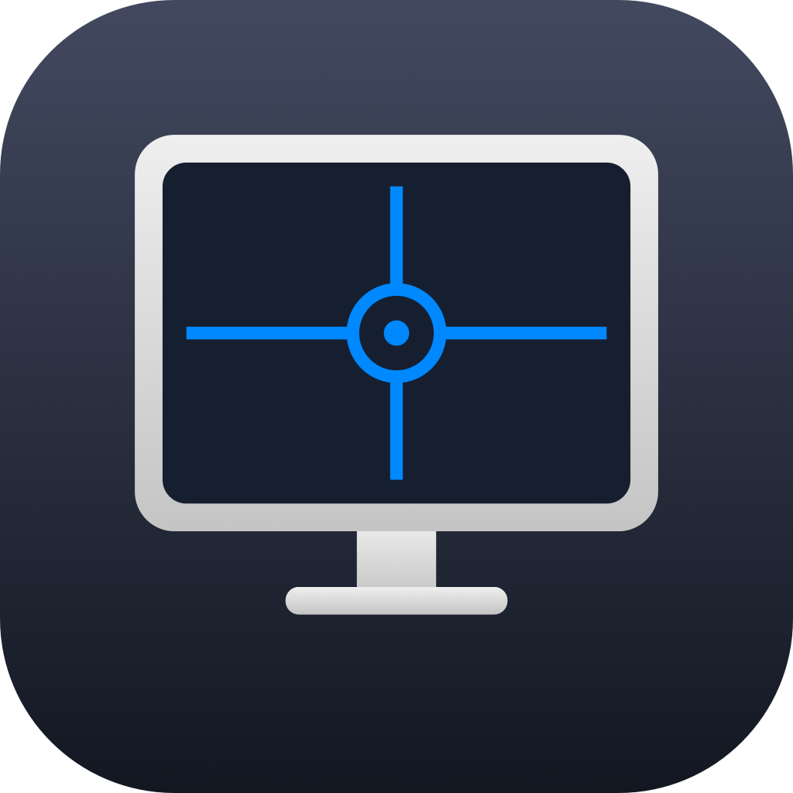

<div align="center">



# Reticle

**Pixel-perfect alignment guides for the macOS “Arrange Displays” panel.**

[](https://www.apple.com/macos/)
[](https://swift.org)
[]()
[](#-license)

<a href="https://buymeacoffee.com/ciaosonokekko"></a>

</div>

---

Got multiple monitors and want them **pixel-perfect aligned** in the *Arrange Displays* sheet? macOS gives you zero visual feedback. **Reticle** does.

A lightweight, click-through overlay living in your menu bar, activating **only** when you open the *Arrange Displays* sheet. Every monitor gets a faint crosshair at its center; the moment two centers line up, the guide **snaps to full opacity** and stretches across the canvas — exactly like Photoshop or Figma smart guides.

## ⬇️ Download & install

1. Grab **`Reticle.dmg`** from the [latest release](https://github.com/ciaosonokekko/reticle/releases).
2. Open the DMG and drag **Reticle** into **Applications**.
3. **First launch — clear Gatekeeper once.** Reticle isn't notarized by Apple (it's a free, open-source build), so macOS blocks it the first time. Pick either:
   - Double-click Reticle → in the dialog open **System Settings → Privacy & Security**, scroll down and click **“Open Anyway”**, then launch again; **or**
   - Run once in Terminal: `xattr -dr com.apple.quarantine /Applications/Reticle.app`
4. From the menu bar icon choose **Grant Accessibility…** (or go to *System Settings → Privacy & Security → Accessibility*) and **flip Reticle's toggle on**. The app is already in the list — no need to browse for it.

That's it — open *System Settings → Displays → Arrange…* and the guides appear.

> **Updating:** since the build isn't Apple-signed, after downloading a new version you'll need to re-enable Reticle in the Accessibility list once.

Prefer to build it yourself? See [Build from source](#-build-from-source).

## ✨ Features

- 🎯 **Faint center crosshairs** drawn inside each display (alpha 0.5).
- ⚡ **Visual snap**: full-opacity, thicker line across the canvas the instant centers align.
- 🎨 **System accent color**: lines and icon follow the user's *Settings → Appearance* accent and update live.
- 🖱️ **Click-through overlay**: never steals focus, never eats mouse events.
- 🧭 **Auto-trigger**: appears only when the *Arrange Displays* sheet is open, disappears when you close it.
- 🥷 **Menu bar app**: no Dock icon, no main window — it stays out of your way.
- 🪶 **Zero dependencies**: pure AppKit + Accessibility API. No SwiftUI, no pods, no SPM.

## 🔨 Build from source

```bash
git clone git@github.com:ciaosonokekko/reticle.git
cd reticle/DisplayAlignGuide
open DisplayAlignGuide.xcodeproj
```

Hit **⌘R** in Xcode. On first launch macOS adds the app to the *Accessibility* list (disabled): just **flip the toggle** in *Settings → Privacy & Security → Accessibility*. You don't need to drag or browse for the binary — it's already there.

To produce a distributable DMG (ad-hoc signed, drag-to-Applications):

```bash
make dmg        # → dist/Reticle.dmg
```

Then, from the menu bar icon:

| Menu item | What it does |
|---|---|
| **Open Arrange Displays** | Opens Displays settings and auto-presses the *Arrange…* button via Accessibility |
| **Accessibility status** | System prompt + on-screen instructions; menu title reflects current state |
| **About Reticle** | Standard About panel with the app icon |
| **Quit** | Terminates the app (including from background) |

## 🧠 How it works

1. `ForegroundWindowWatcher` polls the **Accessibility API** every 150 ms and looks for the *Arrange Displays* sheet inside `com.apple.systempreferences`'s windows.
2. Inside the sheet, the individual monitors are exposed as `AXImage` elements. Their `kAXPositionAttribute` / `kAXSizeAttribute` give the exact on-screen rectangles.
3. `GuideOverlayController` parks a `.nonactivatingPanel` `NSPanel` — borderless, transparent, click-through, top level — over the sheet, **converting AX coordinates (top-left origin) to Cocoa coordinates (bottom-left origin)** against the primary screen.
4. `GuideOverlayView` groups display centers by tolerance: group of 1 → crosshair clipped to the monitor (alpha 0.5); group of ≥ 2 → solid line spanning the full canvas (alpha 1.0, double thickness).

## 📁 Project layout

```
├── DisplayAlignGuide/
│   └── DisplayAlignGuide/
│       ├── main.swift                    explicit NSApplication bootstrap
│       ├── AppDelegate.swift             lifecycle + wiring
│       ├── ForegroundWindowWatcher.swift AX polling, locates the Arrange sheet
│       ├── GuideOverlayController.swift  NSPanel overlay + AX→Cocoa coord conversion
│       ├── GuideOverlayView.swift        guide / alignment line drawing
│       ├── MenuBarController.swift       NSStatusItem, menu, AppIcon, AX press
│       └── Info.plist                    accessory app (no Dock icon)
├── scripts/build-dmg.sh                  Release build + ad-hoc sign + DMG
└── Makefile                              `make dmg`
```

## 🛠 Requirements

- macOS **13.0+** (tested on Sonoma and Sequoia)
- Xcode **15+**
- **Accessibility** permission (to read window geometry via `AXUIElement`)

## 🔒 Privacy

No network, no telemetry, no data collection. The app is not sandboxed: it uses the Accessibility API read-only to fetch window positions and sizes for System Settings, and nothing else.

## ☕ Support

Reticle is free and open source. If it saved you some pixel-pushing, you can support its development:

<a href="https://buymeacoffee.com/ciaosonokekko"></a>

## 📝 License

[MIT](LICENSE) — use it, fork it, enjoy.
